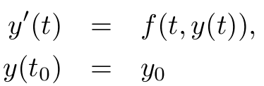
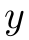
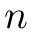
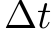
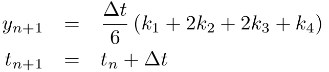
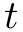

# ode-rk4 [](https://travis-ci.org/scijs/ode-rk4) [](http://badge.fury.io/js/ode-rk4) [](https://david-dm.org/scijs/ode-rk4)

> Integrate a system of ODEs using the Fourth Order Runge-Kutta (RK-4) method


## Introduction

This module integrates a system of ordinary differential equations of the form

<p align="center"></p>

where  is a vector of length . Given time step , the Runge-Kutta 4 method integrates the ODE with update

<p align="center"></p>
where  are given by
<p align="center"></p>

For a similar adaptive method using the fifth order Cash-Karp Runge-Kutta method with fourth order embedded error estimator, see [https://github.com/scijs/ode45-cash-karp](ode45-cash-karp].

## Install

```bash
$ npm install ode-rk4
```

## Example

```javascript
var rk4 = require('ode-rk4')

var deriv = function(dydt, y, t) {
  dydt[0] = -y[1]
  dydt[1] =  y[0]
}

var y0 = [1,0]
var n = 1000
var t0 = 0
var dt = 2.0 * Math.PI / n

var integrator = rk4( y0, deriv, t0, dt )

// Integrate 1000 steps:
integrator.steps(n)

// Integrate all the way around a circle:
// => integrator.y = [ 0.9999999999995743, -8.160481752145232e-11 ]
```


## API

### `require('ode-rk4')( y0, deriv, t0, dt )`
**Arguments:**
- `y0`: an array or typed array containing initial conditions. This vector is updated in-place with each integrator step.
- `deriv`: a function that calculates the derivative. Format is `function( dydt, y, t )`. Inputs are current state `y` and current time `t`, output is the calculated derivative `dydt`.
- `t0`: initial time .
- `dt`: time step .

**Returns**:
Initialized integrator object.

**Properties:**
- `n`: dimension of `y0`.
- `y`: current state. Initialized as a shallow copy of input `y0`.
- `deriv`: function that calculates the derivative. Initialized from input. May be changed.
- `t`: current time, incremented by `dt` with each time step.
- `dt`: time step . Initialized from input `dt`. May be changed.

**Methods:**
- `.step()`: takes a single step of the RK-4 integrator and stores the result in-place in the `y` property.
- `.steps( n )`: takes `n` steps of the RK-4 integrator, storing the result in-place in the `y` property.

## Credits

(c) 2015 Ricky Reusser. MIT License